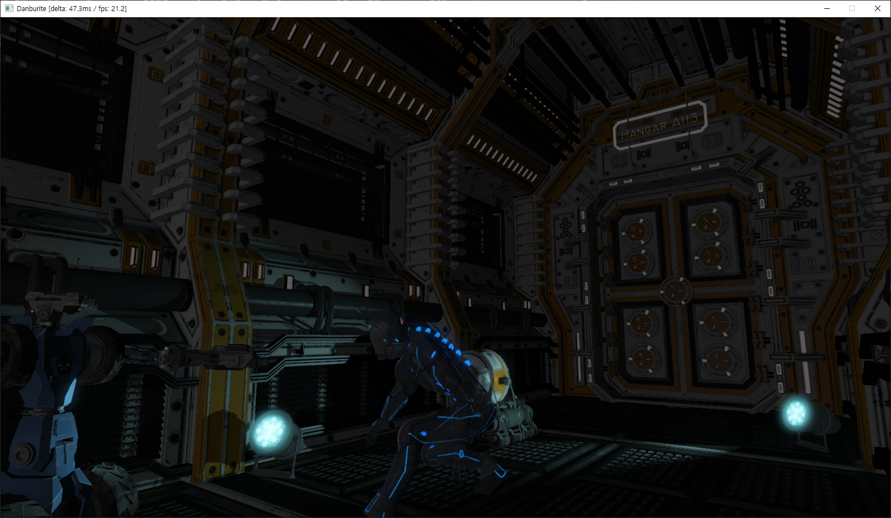

# Danburite

OpenGL 4.6 core 기반의 렌더링 엔진입니다. OpenGL을 OOP 스타일로 운용하는 ObjectGL 라이브러리가 엔진의 기반을 담당하고 있습니다. 
핵심 기능은 다음과 같습니다.

<ul>
<li>Light-prepass pipeline (다중 조명에서 우수한 퍼포먼스 제공)
<li>SSAO(Screen-space Ambient Occlusion)
<li>Bindless texture
<li>Shader compiler
<li>Bloom
<li>HDR
<li>Normal mapping
<li>Parallax mapping
<li>Gamma correction
<li>PCSS(Soft shadow; directional, point, spot light에 대해 모두 제공)
<li>Environment mapping
<li>Skybox (cubemap-based)
<li>Blinn-Phong style lighting
<li>GPU Skinning
<li>Instancing
</ul>

아래는 데모 영상입니다.

