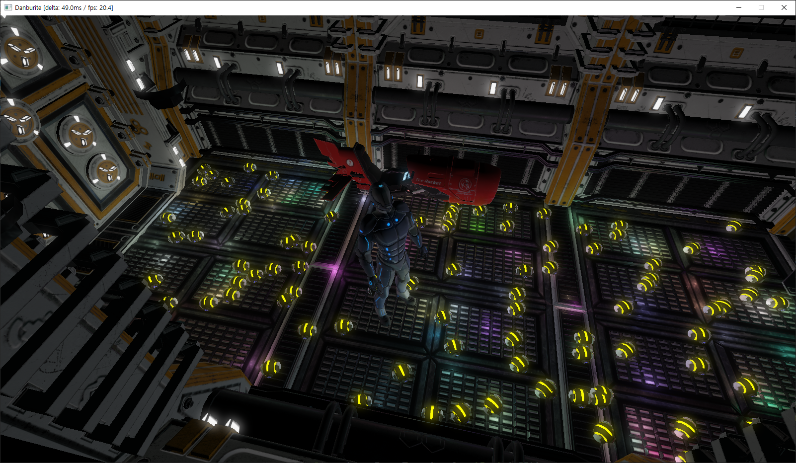

# Danburite
A real-time rendering engine with core-profile OpenGL and C++.

### Abstract ###
Danburite is a rendering engine developed with core-profile OpenGL and latest C++ standard. 
Its architecture consists of 3 phases: ObjectGL(object-oriented OpenGL), rendering engine(Danburite), and the app. Danburite utilizes ObjectGL to abstractly handle OpenGL, while application developers use Danburite to create content. The engine offers simple and intuitive interfaces, facilitating the rapid and easy development of applications.

### Engine Features ###
- Blinn-Phong-based shading
- Silhouette shading
- Refraction/reflection shading
- Postprocessing effects
    - Nagative
    - Grayscale
    - Gaussian blur
    - Edge detection
    - Sharpening
    - Gamma correction
    - HDR
    - SSAO (Screen-Space Ambient Occlusion)
    - FXAA (Fast Approximate Anti-Aliasing)
- Skybox
- Tessellation
- Bindless texture
- PCSS (Percentage Closer Soft Shadows)
- Instancing
- Normal mapping
- Parallax mapping
- GPU skinning

### Demo ###

